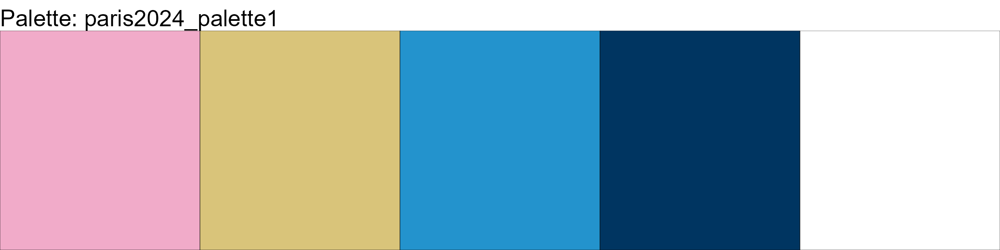
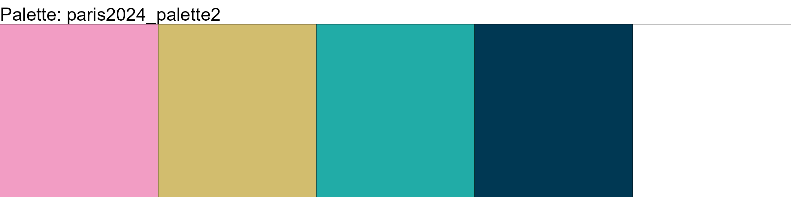
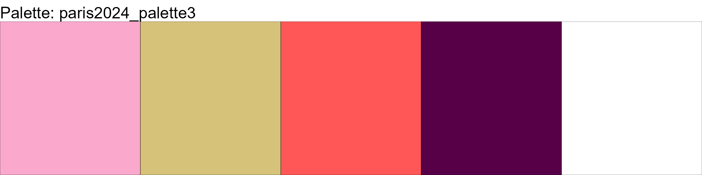
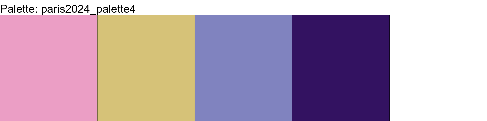
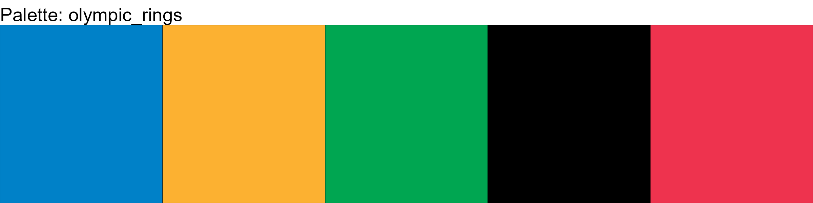
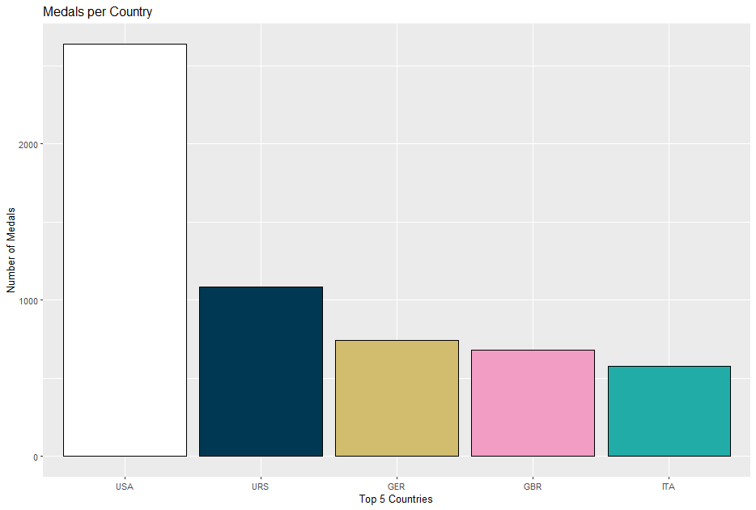
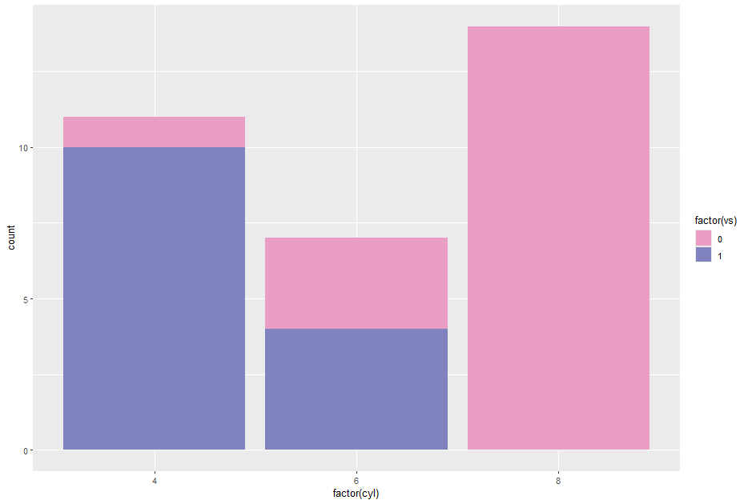
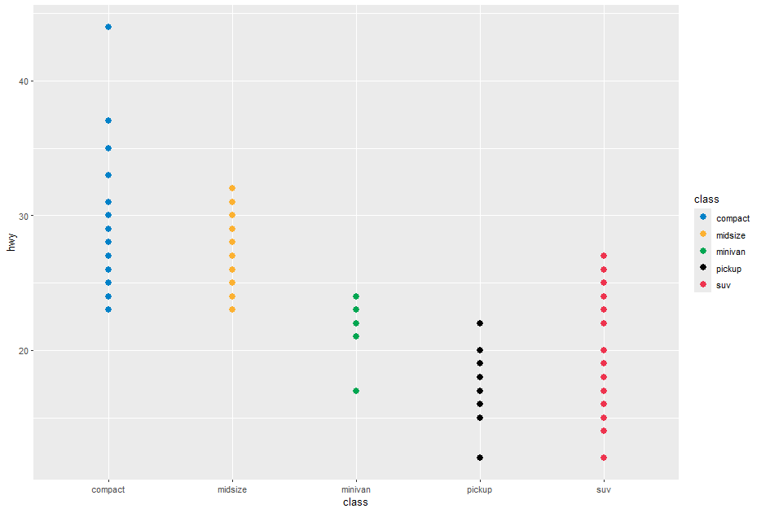

# paris2024color
Paris 2024 Olympics color palette for R

## Reference
[
](https://olympics.com/en/paris-2024/information/the-look-of-the-games)


# Color Palettes for Data Visualization

This repository contains a collection of custom color palettes inspired by the Paris 2024 Olympics. The palettes are designed for data visualization in R using the `ggplot2` library.

## Paris 2024 Palette 1



## Paris 2024 Palette 2



## Paris 2024 Palette 3



## Paris 2024 Palette 4



## Olympic Rings



## Olympic Medals


## R Code Examples

Using 120 years of Olympic history: athletes and results[^1]

```r
data <- read.csv(".../athlete_events.csv")

# Filter and process the data to count gold medals by country
gold_medals <- data %>%
  filter(Medal == "Gold") %>%
  count(NOC, name = "Medal") %>%
  arrange(desc(Medal)) %>%
  head(5)

# Plot the data
ggplot(gold_medals, aes(x = reorder(NOC, -Medal), y = Medal, fill = NOC)) +
  geom_bar(stat = "identity",color = "black", size = 0.7) +
  theme(legend.position = "none") +
  labs(x = "Top 5 Countries", y = "Number of Medals", title = "Medals per Country") +
  scale_fill_manual(values = paris2024_palette2[1:nrow(gold_medals)])
```




```r
library(paris2024color)
ggplot(mtcars, aes(x = factor(cyl), fill = factor(vs))) +
  geom_bar() +
  scale_fill_paris2024_palette4()
```



```r
library(ggplot2)
library(dplyr)
library(paris2024color)

filtered_mpg <- mpg %>%
  filter(class %in% c("compact", "suv", "midsize", "minivan", "pickup"))

# Plot using ggplot2 with the defined palette
ggplot(filtered_mpg, aes(x = class, color = class)) +
  geom_point(aes(y = hwy), size = 3) +
  scale_color_olympic_rings() +
  theme_minimal() +
  labs(
    x = "Vehicle Class",
    y = "Highway MPG",
    title = "Highway MPG by Vehicle Class",
    subtitle = "Using Olympic Rings Palette"
  )
```



[^1]: athlete_events.csv in  https://www.kaggle.com/datasets/heesoo37/120-years-of-olympic-history-athletes-and-results

